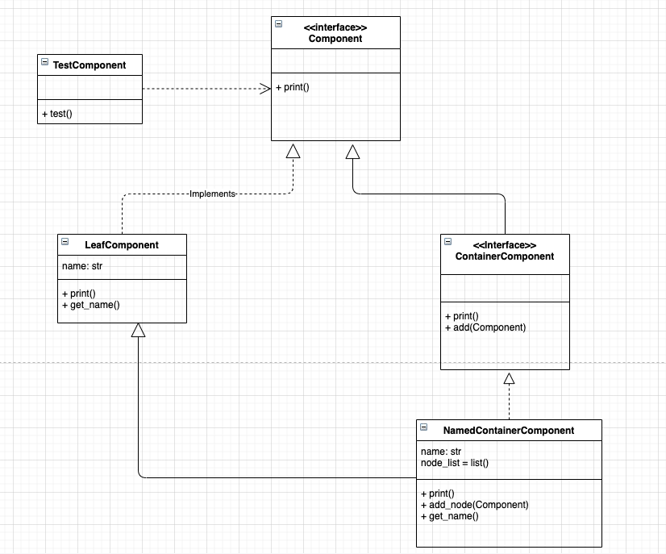

### 作业分析
我们根据组合模式对提供案例进行分析，窗口组件包括了两类组件：
* 抽象组件(Component): 抽象组件
  * `Component.py`
  * `ContainerComponent.py`
* 容器组件(ContainerNode): 可以包含其它的容器组件和叶子组件
  * `NamedContainerComponent.py`
* 叶子组件(LeafNode): 最低层组件，不能再包含其它组件
  * `LeafComponent.py`
  
### 类图

