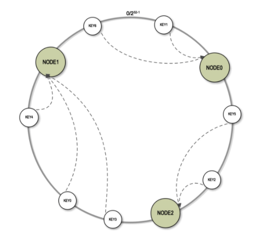

### Consistent Hashing
Consistent hashing is a special kind of hashing such that when a hash table is resized, 
only `n/m` keys need to be remapped on average where `n` is the number of keys and `m` is
the number of slots.

Consistent hashing is mostly used on distributed systems/caches/databases as this avoid the total reshuffling of your key-node mappings when adding or removing a node in your ring (called continuum on libketama).

### Test Results:
* 1,000,000 KVs, 10 physical nodes, 10 virtual nodes:
  * Simple consistent hashing: 74506.19249468837
  * Virtual consistent hashing: 22961.28320431785
* 1,000,000 KVs, 10 physical nodes, 150 virtual nodes:
  * Simple consistent hashing: 74283.5196564861
  * Virtual consistent hashing: 6032.167401154876
